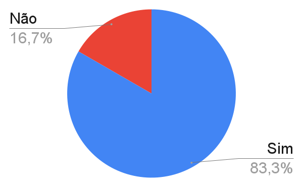

# Relato do Cliente

## Introdução

Este documento apresenta o relato do cliente com base em um formulário elaborado para coletar feedback sobre a implementação do sistema, com base nos critérios de aceitação. O formulário incluiu perguntas acompanhadas de imagens para verificar se os requisitos atendem às expectativas do cliente, identificar melhorias necessárias e avaliar se algo está em falta ou dentro do esperado.

## Relato

### Sprint 2

Nesta sprint, foram entregues ao usuário as seguintes histórias de usuário:

- [US06 - Autenticação (Cadastro)](../user-stories/US06-Cadastro.md)
- [US07 - Autenticação (Acesso)](../user-stories/US07-Acesso.md)
- [US08 - Perfil](../user-stories/US08-Perfil.md)
- [US09 - Publicações de Artigos](../user-stories/US09-Publicacao.md)
- [US10 - Meus Artigos](../user-stories/US10-MeuArtigos.md)
- [US11 - Editar e Apagar Publicação](../user-stories/US11-EditarExcluir.md)

📌 **Link do formulário:** [Formulário de validação, Sprint 2.](https://forms.gle/Ac4FNDqsgRvqtvy47)

### Feedback

Para a sprint 2 o feedback do cliente foi dividido em dois aspectos principais: o produto e o formulário de validação.

#### Produto

Os comentários nesta seção dizem respeito diretamente à experiência do usuário com o sistema.

- [adiciona o toast de cadastro ✔](https://github.com/FGA-REQ/2024.2-6EspiasDemais/commit/2c20aecd9a942897461d1d26d88d5664d29d98ea)

- [adiciona o toast de publicação ✔](https://github.com/FGA-REQ/2024.2-6EspiasDemais/commit/339a94600eca4b92fb94ddbe7b81bbc8f7fd101f)

- [adiciona o toast de edição e modal✔](https://github.com/FGA-REQ/2024.2-6EspiasDemais/commit/f38625f28715ee3127a1a4d3222b906ff2b30985)

- [adiciona o toast de exclusão ✔](https://github.com/FGA-REQ/2024.2-6EspiasDemais/commit/f38625f28715ee3127a1a4d3222b906ff2b30985)

#### Feedback sobre o Formulário

Os feedbacks desta seção dizem respeito à experiência do cliente ao preencher o formulário de validação. Um problema identificado foi uma pergunta repetida com diferentes propostas, gerando confusão. O erro poderia ter sido evitado com revisão prévia ou simulação do preenchimento do formulário.

**Tabela 1** - Problema com as perguntas duplicadas.

| Pergunta problemática | Resposta |
|-----------------------|----------|
| Caso nenhum artigo tenha sido publicado, é mostrada a mensagem "Sem artigos publicados, que tal fazer uma publicação?"? | Sim |
| Caso o usuário não tenha realizado nenhuma publicação, é exibida a mensagem "Você ainda não publicou nenhum artigo"? | A mensagem relatada na pergunta não aparece dessa forma. Mas a forma que está no site está ótima. |

Autor(es): [João Vitor](https://github.com/Jauzimm), 2025.

## Formulario

As perguntas feitas no formulário têm suas respostas como "Sim", "Não" ou "Observação". Aqui se encontram apenas as perguntas e suas respostas, onde o foco é apenas na coleta de dados e documentação, com a inferência de um gráfico ao final, apresentando a porcentagem de aceitação pelo usuário.

## Formulário de Cadastro

**Tabela 2** - Respostas do formulário de cadastro.

| Pergunta | Resposta |
|----------|---------|
| O formulário de cadastro está acessível através de um link escrito "Acessar", localizado na parte superior da página, que direciona o usuário para a página de cadastro? | Sim |
| Os campos "Nome", "E-mail" e "Senha" estão presentes e são marcados como obrigatórios? O botão "Cadastrar" permanece desativado até que todos os campos obrigatórios sejam preenchidos corretamente? | Sim |
| O sistema valida se a senha possui os critérios mínimos de 8 caracteres, 1 letra minúscula e 1 letra maiúscula? | Sim |
| Após o envio do formulário, o sistema exibe uma mensagem de sucesso ("Cadastro realizado com sucesso!") e o usuário é redirecionado para a página de Perfil, ou, em caso de erro, uma mensagem clara e específica (por exemplo, "E-mail já cadastrado")? | Não |
| Observações | Nenhuma |

## Formulário de Acesso

**Tabela 3** - Respostas do formulário de acesso.

| Pergunta | Resposta |
|----------|---------|
| O formulário de acesso está acessível através de um link escrito "Acesso", localizado na parte superior da página, que direciona o usuário para a página de login? | Sim |
| Os campos "E-mail" e "Senha" estão presentes e são marcados como obrigatórios? O botão "Entrar" permanece desativado até que todos os campos obrigatórios sejam preenchidos corretamente? | Sim |
| Ao tentar realizar o login, se algum dos dados estiver incorreto, o sistema exibe a mensagem "E-mail ou senha inválidos"? | Sim |
| Após a realização do login, o usuário é redirecionado para a página de perfil em caso de sucesso? | Sim |
| Observações | Nenhuma |

## Perfil

**Tabela 4** - Respostas do formulário de perfil.

| Pergunta | Resposta |
|----------|---------|
| A tela de perfil está disponível na página "Perfil" e é acessível apenas para usuários que estiverem logados? | Sim |
| O nome do usuário logado são exibidos corretamente na tela de perfil? | Sim |
| Caso o usuário já tenha realizado alguma publicação, elas são listadas corretamente, exibindo título, data de publicação e categoria? | Sim |
| Caso o usuário não tenha realizado nenhuma publicação, é exibida a mensagem "Você ainda não publicou nenhum artigo"? | A mensagem relatada na pergunta não aparece dessa forma. Mas a forma que está no site está ótima. |
| O botão "Sair" funciona corretamente, realizando o logout e redirecionando o usuário para a página de login? | Sim |
| Observações | Nenhuma |

## Publicação de Artigos

**Tabela 5** - Respostas do formulário de publicação de artigos.

| Pergunta | Resposta |
|----------|---------|
| A funcionalidade de publicação está disponível na página "Perfil" e é acessível apenas para usuários logados? | Sim |
| Os campos  Título", "Conteúdo" e "Categoria"  estão presentes e são marcados como obrigatórios? O botão "Publicar" permanece desativado até que todos os campos obrigatórios sejam preenchidos corretamente? | Sim |
| Após enviar o formulário, o usuário recebe um retorno sobre a publicação? Se tudo der certo, aparece a mensagem "Artigo publicado com sucesso!". Caso ocorra algum erro, a mensagem exibida é "Erro ao publicar o artigo. Tente novamente mais tarde." | Não |
| Observações | Nenhuma |

## Meus Artigos

**Tabela 6** - Respostas do formulário de Meus Artigos.

| Pergunta | Resposta |
|----------|---------|
| A página Meus Artigos só é disponível para usuários logados? | Sim |
| Se o usuário já publicou artigos, eles são exibidos em ordem cronológica, do mais recente para o mais antigo? | Sim |
| Caso nenhum artigo tenha sido publicado, é mostrada a mensagem "Sem artigos publicados, que tal fazer uma publicação?"? | Sim |
| Em cada artigo listado, são exibidos o título, a categoria e a data de publicação? Além disso, os botões "Excluir" (para remover o artigo) e "Editar" (para modificá-lo) estão disponíveis? | Sim |
| Ao clicar no botão "Excluir" para remover um artigo, é exibida a mensagem "Você tem certeza de que deseja excluir este artigo?" e o artigo só é realmente excluído após a confirmação do usuário? | Não |
| Existe um botão "Publicar" que redireciona o usuário para a página de publicação de artigos? | Sim |
| Observações | Nenhuma |

## Correções da 1ª Sprint

**Tabela 7** - Respostas sobre as correções da 1ª Sprint.

| Pergunta | Resposta |
|----------|---------|
| Durante a criação ou sugestão de um novo artigo, a página exibe uma mensagem clara e intuitiva que orienta o usuário sobre a finalidade de cada formulário? | Sim |
| As mensagens de erro foram aprimoradas em relação à versão anterior? | Sim |

Autor(es): [João Vitor](https://github.com/Jauzimm), 2025.

### Resultado

Com a medição a partir de um gráfico contendo 23 perguntas respondidas, sendo 20 respostas "Sim" e 4 respostas "Não", temos a seguinte estatística de aceitação pelo cliente:

**Imagem 1** - Gráfico das respostas.

Autor(es): [João Vitor](https://github.com/Jauzimm), 2025.

## Histórico de Versões

**Tabela 8** - Histórico de versões.

| Versão |               Descrição                |   Autor    |    Data    |    Revisor     | Data de revisão |
| :----: | :------------------------------------: | :--------: | :--------: | :------------: | :-------------: |
|  1.0   | Criação do Relato | [João Vitor](https://github.com/Jauzimm) | 06/02/2025 |  |  |

