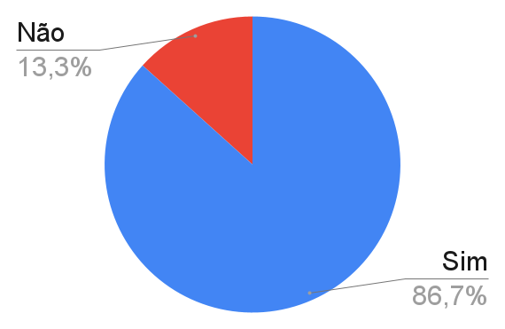

# Relato do Cliente

## Introdução

Este documento apresenta o relato do cliente com base em um formulário elaborado para coletar feedback sobre a implementação do sistema, com base nos critérios de aceitação. O formulário incluiu perguntas acompanhadas de imagens para verificar se os requisitos atendem às expectativas do cliente, identificar melhorias necessárias e avaliar se algo está em falta ou dentro do esperado.

## Relato

### Sprint 1

Nesta sprint, foram entregues ao usuário as seguintes histórias de usuário:

- [US01 - Sobre](../user-stories/US01-Sobre.md)
- [US02 - Feed](../user-stories/US02-Feed.md)
- [US03 - Filtros](../user-stories/US03-Filtros.md)
- [US04 - Sugestão de Tema](../user-stories/US04-SugestaoTema.md)
- [US05 - Sugestão de Artigos](../user-stories/US05-SugestaoArtigo.md)

📌 **Link do formulário:** [Formulário de validação, Sprint 1.](https://docs.google.com/forms/d/e/1FAIpQLSc-cgcZdXnoWx63vPvGGlTYv5FNY2N-KF_ZCkFHGawaxgmESg/viewform)

### Feedback

Para a sprint 1 o feedback do cliente foi dividido em dois aspectos principais: o produto e o formulário de validação.

#### Produto

Os comentários nesta seção dizem respeito diretamente à experiência do usuário com o sistema.

- [Melhorar o foco da página quando o usuário a acessa ✔](https://github.com/FGA-REQ/2024.2-6EspiasDemais/commit/0a6567bf430009604420bea5ab89853e76c0fead)

- [Adicionar explicação sobre os formulários ✔](https://github.com/FGA-REQ/2024.2-6EspiasDemais/commit/ff45e7f0c5aa6c60420b84d77e9d450778846f47)

- [Trocar a mensagem de erro "Not Found" quando não há artigos disponíveis ✔](https://github.com/FGA-REQ/2024.2-6EspiasDemais/commit/717d923961aa777b15129c2ca8401addfe6b8b66)

- [Adicionar a categoria nos artigos ✔](https://github.com/FGA-REQ/2024.2-6EspiasDemais/commit/4c3e31f58627b26355aa1ccee0fbc8e9525eceb5)

#### Feedback sobre o Formulário

Os feedbacks desta seção dizem respeito à experiência do cliente ao preencher o formulário de validação do sistema:

- As perguntas estavam pouco claras; sugeriu-se o uso de palavras mais objetivas.
- As imagens fornecidas não foram suficientes; o cliente precisou rodar o sistema em seu próprio computador para validar as informações.
- A explicação das perguntas deveria ser melhorada para garantir maior compreensão.
- Foi solicitado remover os cartões das User Stories dos formulários, pois isso não era necessário para o contexto da validação.

## Formulario

As perguntas feitas no formulário têm suas respostas como "Sim" ou "Não". Aqui se encontram apenas as perguntas e suas respostas, onde o foco é apenas na coleta de dados e documentação, com a inferência de um gráfico ao final, apresentando a porcentagem de aceitação pelo usuário.

### Sobre

**Tabela 1** - Resposta do formulario da parte sobre.

| Pergunta | Resposta |
|----------|---------|
| É possível acessar a página através de um menu ou link na página inicial do blog de forma clara? | Sim |
| A página exibe corretamente os campos "Objetivo", "Como Funciona" e as informações de contato (e-mail e link ou indicação para o formulário Sua Voz na Ciência)? | Sim |
| As informações da página são claras e a fonte usada é legível? | Sim |
| Observações | Nenhuma |

Autor(es): [João Vitor](https://github.com/Jauzimm), 2025.

### Feed

**Tabela 2** - Resposta do formulario da parte feed.

| Pergunta | Resposta |
|----------|---------|
| Os artigos estão ordenados de forma cronológica? | Sim |
| Os artigos listados mostram as informações: título, introdução curta, data de publicação, categoria associada ao artigo? | Não |
| Ao utilizar os filtros, é possível filtrar por categorias disponíveis, palavras-chave ou data de publicação? | Sim |
| O feed carrega automaticamente ao acessar a página inicial ou ao redefinir os filtros? | Sim |
| Caso não exista nenhum artigo sobre uma categoria, a mensagem informando que não há artigos sobre esse tema está clara? | Não |
| As informações da página são claras e a fonte usada é legível? | Sim |
| Observações | Nenhuma |

Autor(es): [João Vitor](https://github.com/Jauzimm), 2025.

### Formulários de Sugestão de Tema e Artigo

**Tabela 3** - Resposta do formulario da parte sugestão de eema e artigo.

| Pergunta | Resposta |
|----------|---------|
| O formulário de sugestão de tema apresenta os seguintes campos obrigatórios: Nome, E-mail, Categoria e Descrição do Tema? | Sim |
| O formulário de sugestão de artigo apresenta os seguintes campos obrigatórios: Nome, E-mail, Categoria, Título do Artigo e Conteúdo do Artigo? | Sim |
| O botão de envio só é ativado quando todos os campos obrigatórios foram preenchidos? | Sim |
| Após o envio do formulário, as mensagens exibidas estão claras e adequadas, tanto para confirmação de sucesso ('Sugestão de artigo enviada com sucesso!') quanto para informar o motivo em caso de erro? | Sim |
| Após o envio do formulário, as mensagens exibidas estão claras e adequadas, tanto para confirmação de sucesso ('Sugestão de tema enviada com sucesso!') quanto para informar o motivo em caso de erro? | Sim |
| É possível acessar os formulários pela página Sua Voz na Ciência? | Sim |
| Observações | Não esta claro o que é cada parte do formulário. |

Autor(es): [João Vitor](https://github.com/Jauzimm), 2025.

### Resultado

Com a medição a partir de um gráfico contendo 15 perguntas respondidas, sendo 13 respostas "Sim" e 2 respostas "Não", temos a seguinte estatística de aceitação pelo cliente:

**Imagem 1** - Gráfico das respostas.

Autor(es): [João Vitor](https://github.com/Jauzimm), 2025.

## Histórico de Versões

**Tabela 4** - Histórico de versões.

| Versão |               Descrição                |   Autor    |    Data    |    Revisor     | Data de revisão |
| :----: | :------------------------------------: | :--------: | :--------: | :------------: | :-------------: |
|  1.0   | Criação do Relato | [João Vitor](https://github.com/Jauzimm) | 01/02/2025 |  |  |
